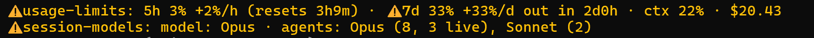

# claude-mods

Three [Claude Code](https://claude.com/claude-code) mods and an audit. Two mods tell you a session is eating your usage limits while you can still stop it, not after you hit the wall. The third keeps subagents from growing large enough to do that. The audit looks back over a month of your sessions and tells you, with numbers, what to change.

The first two each add a dim line above the prompt, with only the warnings in color:



[`usage-limits`](plugins/usage-limits) tracks the 5-hour and weekly windows. It shows how much of each you've used, how fast that number is climbing, and when it will hit 100% if that comes before the reset.

[`session-models`](plugins/session-models) tracks the agents in your session: which models they run on, how many are running right now, and how much context each one sends with every request.

[`pit-stop`](plugins/pit-stop) acts on that last number. It tells the main agent how to size and split work. When a subagent's context grows large, it calls the subagent in for a pit stop: the agent writes a handoff note, and a fresh agent goes back out with it. Past a hard limit it refuses the subagent's tools.

## Why these exist

I built these after a long session burned through my limits while everything on screen looked fine. I had done what the guides say: hand big work to subagents and pick the right model for each. It still got away from me. Here's how that happens.

You start a big job. You tell Claude to split it across subagents, Opus for the hard parts and Sonnet for the rest, and you put a strong model in charge. It goes well. Agents start, finish and report back.

Hours later the conversation has been compacted a few times. Somewhere in a summary, "Opus for the hard parts" became "use agents." New agents start without a model, so they run on whatever the main thread runs on. One agent's job grows from a fix into a whole feature, and every request it makes sends half a million tokens of context. Nothing on screen changes. The main thread looks calm because it is calm. The spending is happening where you aren't looking.

You find out when you hit the wall.

Nobody did anything wrong. Claude followed the instructions it still had, and you gave good ones at the start. Long sessions wear instructions down, and you can't steer by what you can't see.

These mods are the sign before the sharp bend. They don't take the wheel. They tell you what's ahead while you can still brake:

```
⚠ 5h 41% +38%/h out in 1h33m · 7d 18% +6%/d (resets 4d2h) · ctx 22% · $14.10
model: Fable · agents: Fable (6, 5 live), Opus (27), Sonnet (1) · ⚠ ctx 645K
```

Your agents have drifted onto your most expensive model, one of them is carrying a huge context, and at this pace the 5-hour window runs out in an hour and a half. You'd see all of that hours before the wall, while it's still cheap to fix.

pit-stop is the exception. The other two are the gauges and the road signs, and pit-stop is the pit crew. It changes what your agents do, so install it only if you want that.

[`workflow-audit`](plugins/workflow-audit) is the post-race review. The mods watch one session at a time; the audit reads a month of your transcripts and runs as a command, `/workflow-audit`, in its own session. It finds where your spend and rework go, checks your habits against current advice from Anthropic's docs and staff (dated, graded by evidence, and marked when later advice reversed it), and gives you at most five findings, each with one experiment to try. The next run tells you whether the experiment worked. It needs Python 3.9 or newer; everything stays on your machine.

## Install

You need Claude Code 2.1.287 or newer, the first release with mods. The mod API is early access and can change between releases.

```
/plugin marketplace add AbhiramDwivedi/claude-mods
/plugin install usage-limits@claude-mods
/plugin install session-models@claude-mods
/plugin install pit-stop@claude-mods
/plugin install workflow-audit@claude-mods
```

The mods load when your next session starts.

To get updates automatically, including the audit's advice catalog as models and Claude Code change, run `/plugin`, open **Marketplaces**, select claude-mods and choose **Enable auto-update**. It is off by default for marketplaces outside Anthropic's own.

`/plugin install` installs for your user by default, so a mod runs in every project. Keep it that way for usage-limits and session-models. Your limits are shared by every session you run, and the session burning through them may be in a project you didn't think to set up. pit-stop changes what agents do, so you may prefer `claude plugin install pit-stop@claude-mods --scope project` in the projects you want it in.

Each threshold appears as a row in `/config`. You can also set it under `pluginConfigs` in `~/.claude/settings.json`.

| Mod | Setting | Default | What it does |
| --- | --- | --- | --- |
| usage-limits | `warnAtPercent` | 90 | Toasts once when a window passes this percentage. |
| usage-limits | `rateWindowMinutes` | 30 | Sets how far back the 5-hour burn rate looks (10 to 300). |
| session-models | `liveAgentsWarn` | 6 | Warns when this many agents run at once, counting the main thread. |
| session-models | `contextWarnK` | 300 | Warns when a running agent sends this many thousand tokens of context per request. |
| pit-stop | `nudgeAtK` | 300 | Asks a subagent to checkpoint when its requests carry this many thousand tokens of context. |
| pit-stop | `stopAtK` | 450 | Gives a subagent 8 tool calls to checkpoint past this many thousand tokens, then refuses its tools. |
| pit-stop | `cacheNotes` | on | Tells a subagent when its prompt cache expired during a long pause. The toast to you stays either way. |

Claude Code also has a built-in mod worth turning on alongside these. "You should know" runs a side agent that points out things you or Claude may have missed. Enable it with `/plugin enable cc-plugin-you-should-know@builtin`. It needs a first-party session with telemetry on.

## Reading the usage line

`5h 24% (resets 2h14m)` means you've used 24% of the 5-hour window and it resets in 2 hours 14 minutes.

`+38%/h` is how fast the 5-hour figure has climbed over the last 30 minutes. It appears after 5 minutes of readings, and only when the rate reaches 1% an hour.

`+6%/d` is the weekly window's pace, measured as the average since the week began, nights and weekends included. A busy afternoon would make a 30-minute rate look alarming for a whole week, so this mod doesn't use one. The weekly pace appears 6 hours into the week.

`⚠ 5h 41% +38%/h out in 1h33m` means that at this pace the window runs out in 1 hour 33 minutes, before it resets. A toast fires the first time this happens in each window. Another fires when you pass `warnAtPercent`.

`5h reset` means the last reading's reset time has passed. The next request brings a fresh figure.

`ctx 22%` is how full the main thread's context window is. `$14.10` is the session's cost at API prices, the same figure `/cost` reports.

`cache drops 3 (1.9M)` appears once an agent's prompt cache has expired during a pause of more than 4 minutes and its next request rebuilt at least 100K tokens of context. It counts the main thread and every subagent: three drops so far this session, which re-wrote 1.9M tokens. Subagents keep their cache for 5 minutes unless you set `subagentPromptCacheTtl`, so an agent that waits on a long test run or a sleep loop pays to rebuild its whole context.

## Reading the agents line

`model: Opus` is the main thread's model. Until a subagent runs, that's all the line shows.

`agents: Opus (14, 13 live), Sonnet (2)` counts every agent the session has run, by model: the main thread, subagents and teammates that run inside the session. Fourteen have used Opus and 13 of those are running now. An agent that switched models counts under each. An agent started without a model runs on the main thread's model, so if your main thread's model shows up here when you meant the work to go to cheaper ones, that's the sign.

`⚠ 14 live` appears while at least `liveAgentsWarn` agents are running. The toast fires once. It fires again only after the count drops 2 below the threshold, and never twice within 10 minutes.

`⚠ ctx 910K` is the largest context any running agent sent with its last request. The agent pays for that context again on every request, so a handful at this size will drain a window fast. Each agent gets one toast when it first crosses `contextWarnK`.

## What pit-stop does

session-models shows you an agent carrying a huge context. pit-stop keeps agents from getting there. The main agent still decides how to split the work, because only it knows the task. The mod gives it the rules and enforces two limits.

The main agent gets a short section in its system prompt. It says to give each agent one phase of work and to run agents in parallel only when they edit different files. When they would share files, it says to run a relay instead: one fresh agent per phase, each starting from the last one's handoff note. The `pit-stop:split-work` skill has the longer version, with templates for briefs and handoff notes and a guide to picking each agent's model.

The section also tells the main agent to set a model on every subagent. An agent started without one runs on the session's model unless you set a fallback. If your session runs on an expensive model, set `CLAUDE_CODE_SUBAGENT_MODEL` in the `env` block of `~/.claude/settings.json`, for example to `sonnet`.

Every subagent's brief gets a context budget added to the end. It asks the agent to read files by line range, keep command output short, and write a handoff note if it is asked to checkpoint.

When a subagent's requests carry `nudgeAtK` thousand tokens of context, its next tool result comes with a note asking it to finish its current item and checkpoint. Past `stopAtK`, it gets 8 more tool calls to commit and write its note, and then every tool call is refused. Its final report starts with `CHECKPOINT:`, which tells the main agent to start a fresh agent from the note rather than resume the old one. A toast tells you each time.

The brief also asks agents to run the narrowest command that proves a change and not to wait in sleep loops. If a subagent's cache still expires while it waits on its own tool call, the mod tells it once how much context it rebuilt and after how long a pause, and suggests checking on long jobs sooner or running something shorter. It gives no fixed polling interval, because whether polling pays depends on your plan and your jobs. Replayed over 945 real subagents, the note would have reached about 4% of agents in normal sessions.

The defaults come from two analyses. One replayed 32 subagents from a long session against different limits, pricing every request at API rates. That includes re-writing an agent's whole context into the cache after it sits idle for more than five minutes, which was about a quarter of the cost. The other measured 938 subagents from a month of sessions on another machine. Both put the best limit at about twice the context an agent carries when it makes its first edit. Both datasets come from one person's work, so treat the defaults as a starting point and tune `nudgeAtK` and `stopAtK` for yours.

A fresh agent starts with 35K to 45K tokens of context. One briefed with a single phase of work read about 117K more before its first edit. For those agents the best limit was 300K to 350K, which cost about a fifth less than no limit. Lower limits backfire, because every agent cut off has to pay that startup again. At 200K the replay cost about a third more than no limit. At 250K it saved half as much as at 300K and ran 26% slower, against 13% at 300K. Agents briefed with a whole feature read about 220K before their first edit, and for them every limit up to 400K cost more than no limit.

Most agents never reach the limits. On the second machine the median agent peaked at 119K, and nearly all the saving came from a few runaway sessions. Briefs matter more than the limit. Most of what an agent reads before its first edit is command output, such as `cat`, `grep` and test runs, so a brief that names the exact files and line ranges pays off. Cutting the reading before the first edit from 135K to 100K more than doubled the saving at 300K. For a small fix, or edits where each step depends on the last, skip the subagent: the main thread already has the context.

## Limitations

The limit figures come from this session's own API responses. Your windows are shared by every session you run, but a session only learns the latest numbers when it makes a request. An idle session's line falls behind. The session doing the damage stays current.

Only Claude subscriptions (Pro and Max) report limits. With an API key, the usage line reads `limits: no reading yet`.

Teammates that run in their own terminal or tmux pane don't show up in the lead's count. Each is a separate process with its own copy of the mod. Teammates inside the lead's process are counted.

Burn rate is measured in percent of your window, not tokens. However your plan weighs cached reads, output and different models, the percentage already includes it.

The agent counts reset on `/clear`. They survive a mod reload but not a restart.

pit-stop never limits the main thread, which Claude Code compacts on its own. It doesn't limit forks either, because a fork starts with its parent's whole context and shares its prompt cache.

pit-stop keeps its counts inside the mod, so a reload starts them over. After one, an agent may be asked to checkpoint a second time, and a fork that is still running loses its exemption.

## Develop

To run the mods from a clone instead of the marketplace, pass the folders for one session:

```
claude --plugin-dir ./plugins/usage-limits --plugin-dir ./plugins/session-models --plugin-dir ./plugins/pit-stop --plugin-dir ./plugins/workflow-audit
```

Or list them in the `env` block of `~/.claude/settings.json`. Separate the paths with `;` on Windows and `:` elsewhere:

```json
{ "env": { "CLAUDE_CODE_PLUGIN_DIRS": "/path/to/claude-mods/plugins/usage-limits:/path/to/claude-mods/plugins/session-models:/path/to/claude-mods/plugins/pit-stop" } }
```

An interactive session watches those folders and reloads a mod when you save a file.

Load each mod one way only. If it is in `CLAUDE_CODE_PLUGIN_DIRS` and also installed from the marketplace, it runs twice, with every line and toast doubled. `claude plugin list` shows both copies.

[`tools/ctx-study`](tools/ctx-study) reads your local session transcripts and reports how large your subagents grow, how much of the cost comes above pit-stop's limits, and whether its handoffs pay off. Run it weekly to check the limits still suit how you work.

Before you commit:

```
claude plugin validate plugins/usage-limits   # checks the manifest and module as the engine reads them
claude plugin test plugins/usage-limits       # runs tests/*.test.ts
python -m unittest discover -s plugins/workflow-audit/tests   # the audit's script
```

When a mod loads, Claude Code writes its API types into the mod's `.claude-plugin/types/` folder, along with a list of the MCP tools on your machine. Git ignores that folder. After the first load, `tsc -p plugins/<mod>` type-checks the mod.

## License

[MIT](LICENSE)
